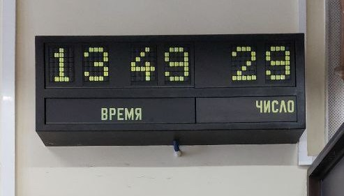
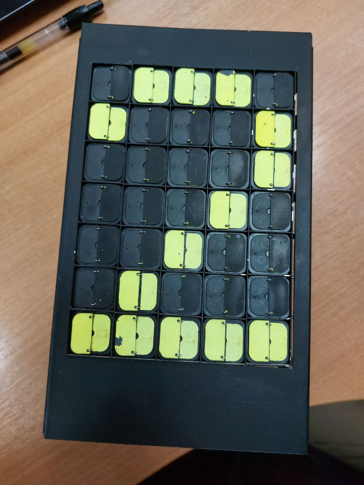
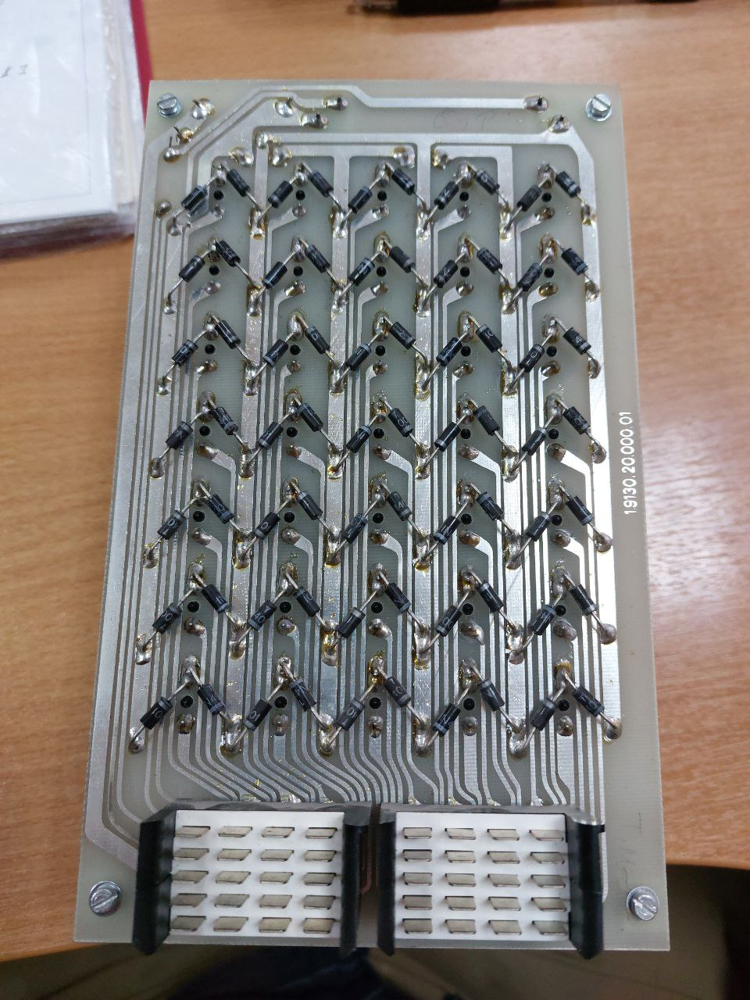
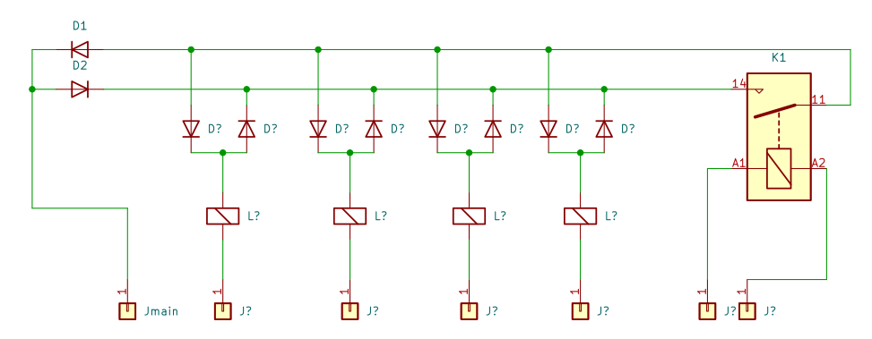
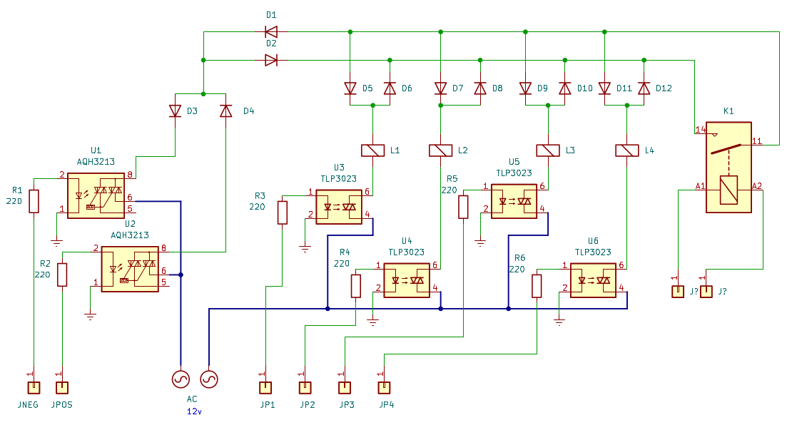
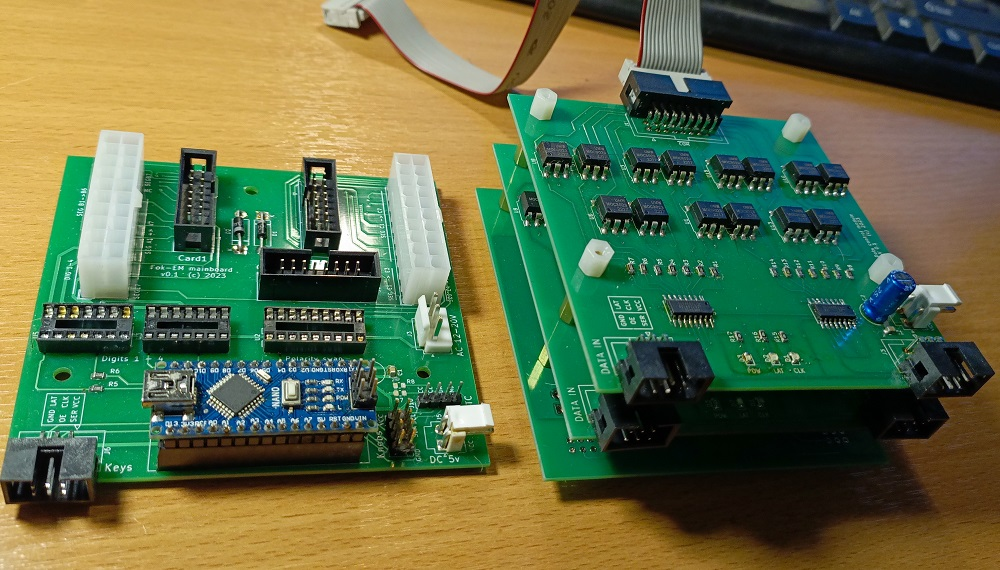
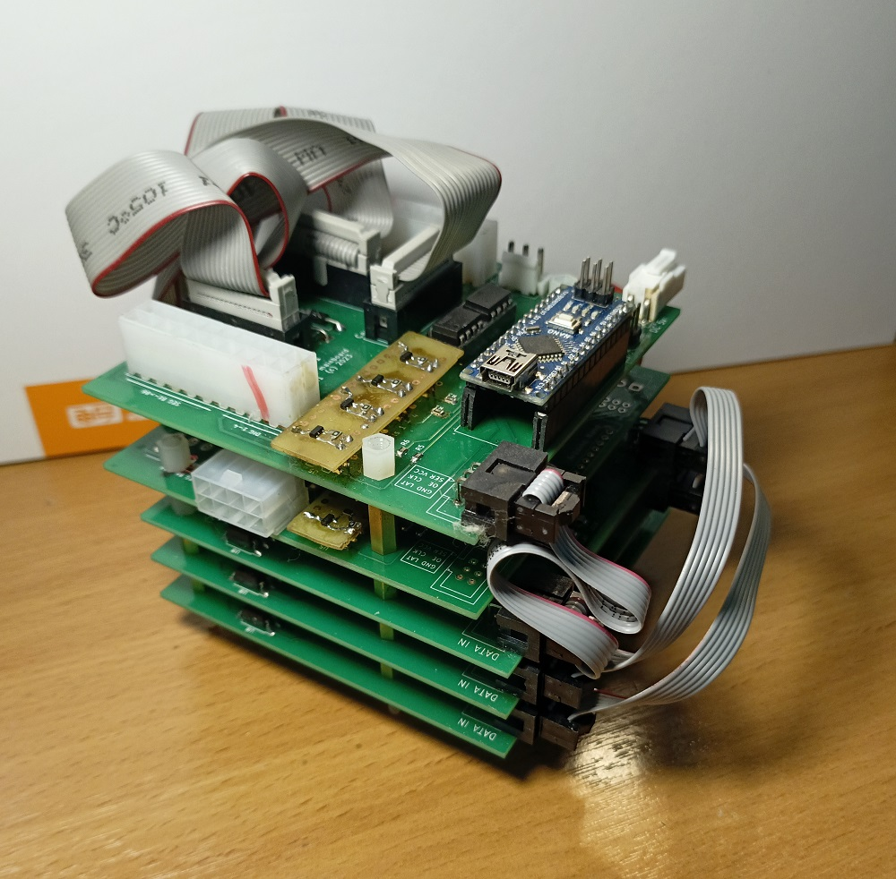
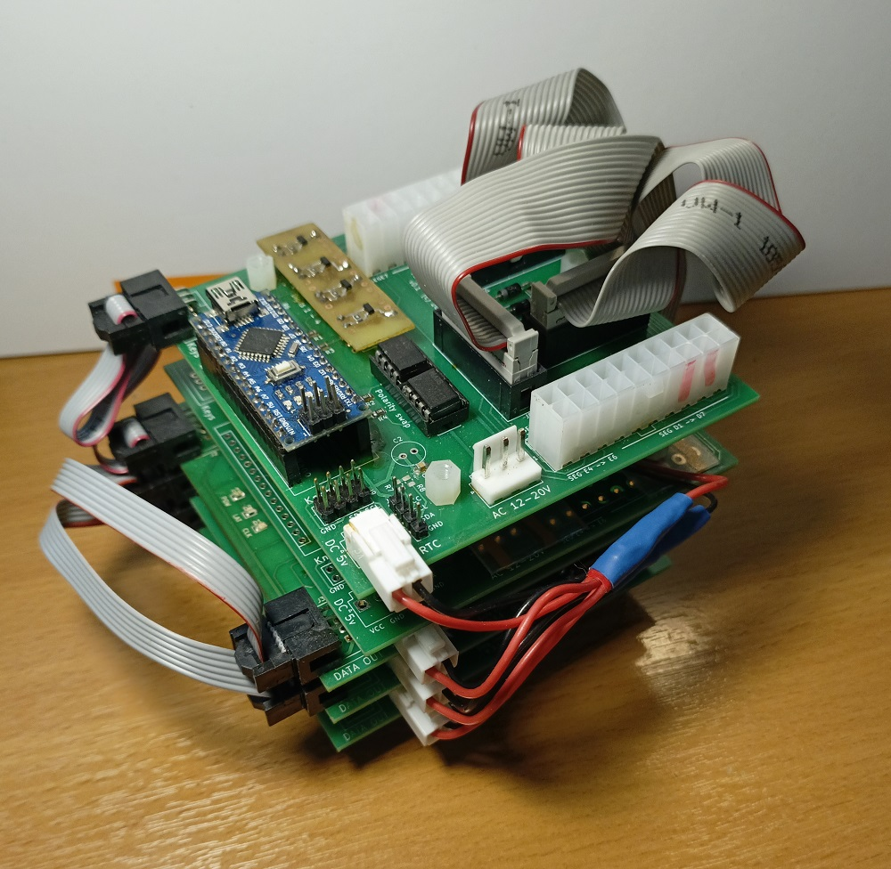
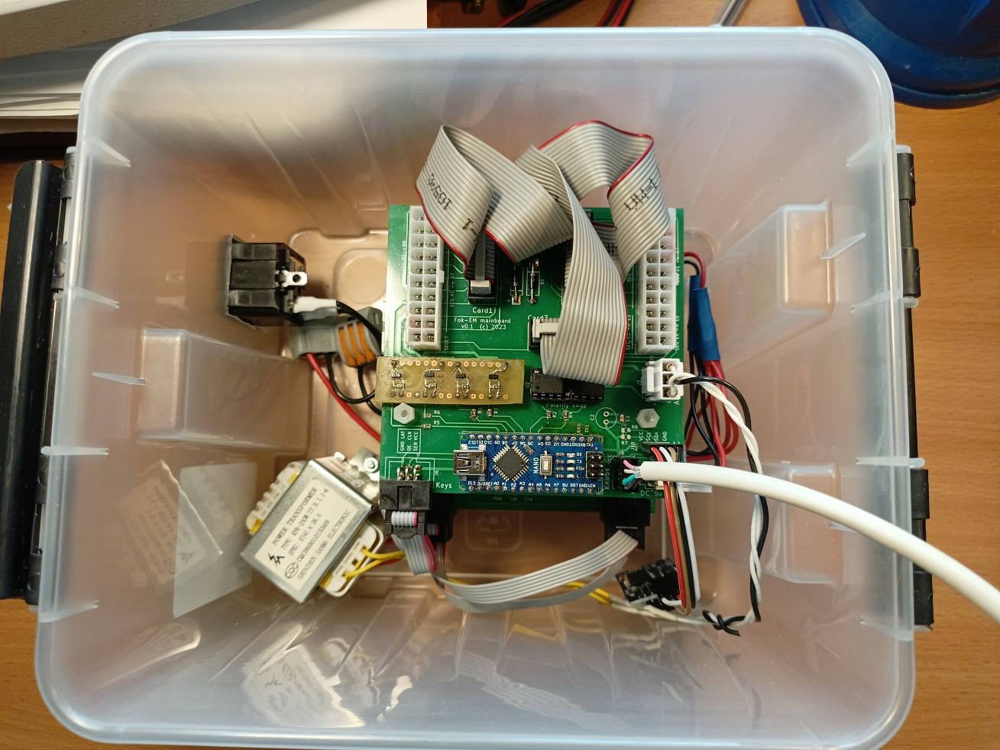

# Fok_Gyem flipdot clock

Проект по воссозданию блока управления часов на основе перекидных (flip_dot, блинкер) модулей венгерской фирмы Fok_GYEM. Внешний вид часов до разборки:

Каждый из цифровых блоков выглядит так:

 

Размеры примерно 200х115мм, вес каждого блока около 1 кг.

## Принцип управления
Для формирования изображения используются точки-блинкеры. Каждый блинкер представляет из себя пластиковую шторку, управляемую электромагнитной катушкой. Одна сторона шторки черная, другая покрашена светоотражающей краской. При подаче напряжения на катушку шторка открывается или закрывается, в зависимости от полярности. После снятия напряжения шторка сохраняет свое положение месяцы и даже годы.
На каждом модуле 35 блинкеров, формирующих изображение 5х7 пикселей. Схема коммутации блинкеров показана ниже (для упрощения на рисунке только 4 катушки из 35).

Один контакт всех катушек на модуле обьединен на общий провод Jmain, что исключает применение матричной схемы управления. Реле K1 блокирует управление всеми блинкерами модуля, что позволяет управлять несколькими модулями последовательно по одному кабелю.

Чтобы не придумывать сложную мостовую схему на каждую катушку для изменения полярности, я решил использовать переменный ток. Идея управления передается схемой ниже. Включением нужного блинкера управляем оптосимисторами U3-U6, а полярность сигнала выбирается одним из оптореле U1-U2, включенным через диоды D3 D4. Остается подать на блок переменный ток в течении одного периода и полуволна нужной полярности переключит выбранные блинкеры.

Схема получается довольно обьемной - 35 оптосимисторов - но при этом простой и дешевой. Оптосимисторы управляются через каскад из пяти сдвиговых регистров - по одному на каждую вертикальную колонку блинкеров. В проекте использовано 6 цифровых блоков - 4 для вывода часов и два для даты, как в оригинале. Выбор нужной цифры при обновлении изображения осуществляется реле К1 на каждом блоке, управляемое постоянным током через мосфеты. Всей схемой в целом управляет плата Ардуино Нано. Код выложен в папке src.

## Печатные платы
Для размещения деталей было разработано два типа плат (нарисованы в Кикаде и изготовлены PcbWave). Первый тип - для размещения оптосимисторов и сдвиговых регистров (по 14 и 2 соответвенно). Таких плат понадобилось три. Вторая плата - плата управления, для Ардуино, реле полярности и соединителей. Эта плата планировалась одна, так как первоначально в проекте должно было быть только 4 блока цифр для вывода времени. В дальнейшем захотелось добавить еще и дату, так что пришлось использовать еще одну основную плату для дополнительных деталей (благо китайские сервисы присылают в заказе по 5 плат и более).

 

Пять плат были собраны в этакую стопку:

 

и помещены в общий корпус вместе с блоком питания, часов и кнопочным пультом управления на основе ТМ1638.

 

