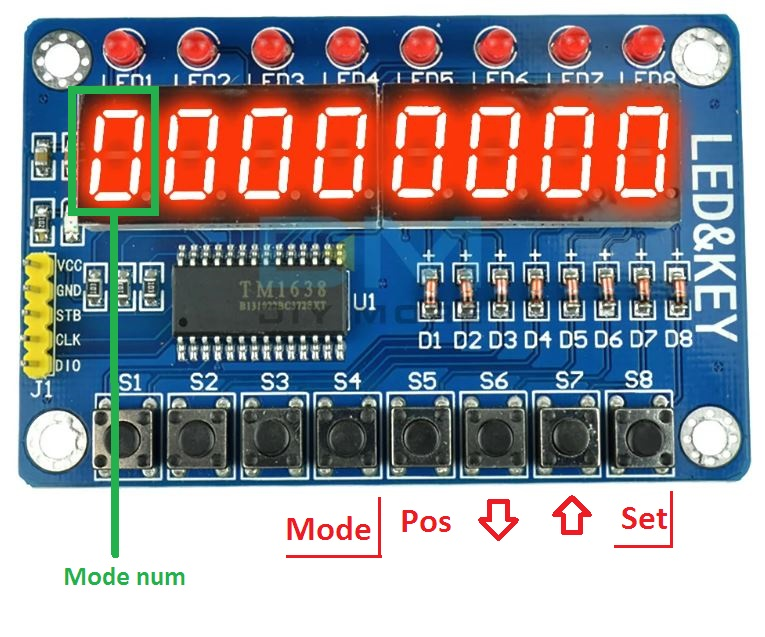

# Кнопочный пульт управления

Поскольку блинкерные индикаторы - достаточно медленные устройства, то установку времени и даты на часах я решил делать на внешнем устройстве с дисплеем. Как только время установлено, оно запоминается модулем RTC и отправляется на основной дисплей. На роль внешнего устройства отлично подошел готовый модуль на основе контроллера TM1638, оснащенный 8 семисегментными индикаторами и 8 кнопками:

У пульта 4 режима. Номер режима отображается на самой левой цифре, нумерация режимов идет с нуля. Переключение режимов осуществляется кнопкой S4 "Mode" циклически.

### Режим 0 - TEST

В этом режиме происходит кратковременная засветка, а потом выключение всех точек всех цифр. Режим запускается кнопкой S8 "Set". По окончании проверки часы автоматически переходят в режим 1 (показа времени). Видео работы режима "Test" можно посмотреть [по ссылке](https://youtu.be/aBFGRFe8ESA).

### Режим 1 - Часы

Нормальный режим работы часов. На блинкерных блоках выводится время и текущая дата, на 4х крайних индикаторах пульта дублируется текущее время.

### Режим 2 - Установка времени

На 4х правых индикаторах пульта показывается текущее время. Клавишей S5 "Pos" выбираем изменяемый разряд времени - часы (обе цифры сразу), десятки или единицы минут. Изменяемый разряд подсвечивается светодиодами над цифрами. Клавишами S6 "меньше" и S7 "больше" изменяем цифры до получения нужного значения. После установки правильного времени нажимаем S8 "Set" для запоминания. После ввода нового времени часы автоматически переходят в режим 1.

При необходимости выйти из режима без сохранения новых значений нажимаем S4 "Mode" пока в левой позиции индикатора не появится цифра 1 - режим часов.

### Режим 3 - Установка даты

На дисплее пульта выводится текущая дата в виде "число-месяц-год", например "14-04-24". Клавишей S5 "Pos" выбираем изменяемый разряд даты. Изменяемый разряд подсвечивается светодиодами над цифрами. Клавишами S6 "меньше" и S7 "больше" изменяем цифры до получения нужного значения. После установки правильной даты нажимаем S8 "Set" для запоминания. После ввода нового времени часы автоматически переходят в режим 1.

При необходимости выйти из режима без сохранения новых значений нажимаем S4 "Mode" пока в левой позиции индикатора не появится цифра 1 - режим часов.
